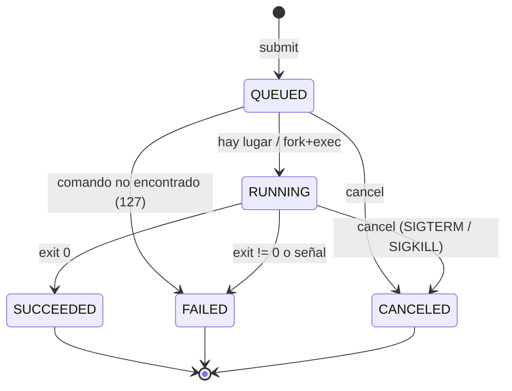

# Modelo preliminar de estados

Issue: #6 · Código: [`src/nexus/states.py`](../src/nexus/states.py)

Cada trabajo está siempre en **uno** de cinco estados:

| Estado | Significado | ¿Final? |
| :----- | :---------- | :-----: |
| `QUEUED` | Registrado, esperando lugar para ejecutarse. | No |
| `RUNNING` | Hay un proceso hijo vivo ejecutándolo (tiene PID). | No |
| `SUCCEEDED` | El proceso terminó con código de salida `0`. | Sí |
| `FAILED` | Código distinto de `0`, murió por una señal no pedida, o no se pudo lanzar. | Sí |
| `CANCELED` | El usuario pidió cancelarlo (o el servicio se apagó). | Sí |

## Diagrama



Versión en texto (por si el diagrama no se ve):

```
QUEUED ──(hay lugar)──► RUNNING ──(exit 0)────────────► SUCCEEDED
  │                        ├──────(exit ≠ 0 o señal)──► FAILED
  │                        └──────(cancel)────────────► CANCELED
  ├──(cancel)─────────────────────────────────────────► CANCELED
  └──(comando no encontrado)──────────────────────────► FAILED
```

## Reglas

1. Solo se permiten las transiciones del diagrama. Cualquier otra (por ejemplo
   `SUCCEEDED -> RUNNING`) lanza `InvalidTransition` y **no** se guarda.
2. Los estados `SUCCEEDED`, `FAILED` y `CANCELED` son **finales**.
3. Cada transición se guarda en la tabla `events` con hora UTC, dentro de la
   misma transacción que cambia el estado (todo o nada).
4. `cancel` sobre un trabajo final no hace nada y regresa su estado actual.
5. Al iniciar, el servicio pasa a `FAILED` los trabajos que quedaron en
   `RUNNING` por un apagado abrupto (no hay forma de saber cómo terminaron).

## Código de salida guardado (`exit_code`)

| Valor | Significado | Estado |
| :---- | :---------- | :----- |
| `0` | Éxito | `SUCCEEDED` |
| `1..125` | El programa reportó un error (ej. `ls` de algo inexistente da `2`) | `FAILED` |
| `126` | La ruta existe pero no se puede ejecutar (sin permiso de ejecución) | `FAILED` |
| `127` | Comando no encontrado | `FAILED` |
| negativo `-N` | Murió por la señal `N` (`-15` = SIGTERM, `-9` = SIGKILL) | `CANCELED` si se pidió, si no `FAILED` |

## Pendiente para el Hito 2

- Estado o razón explícita para "rechazado por cola llena".
- Medir el tiempo en cola y en ejecución.
